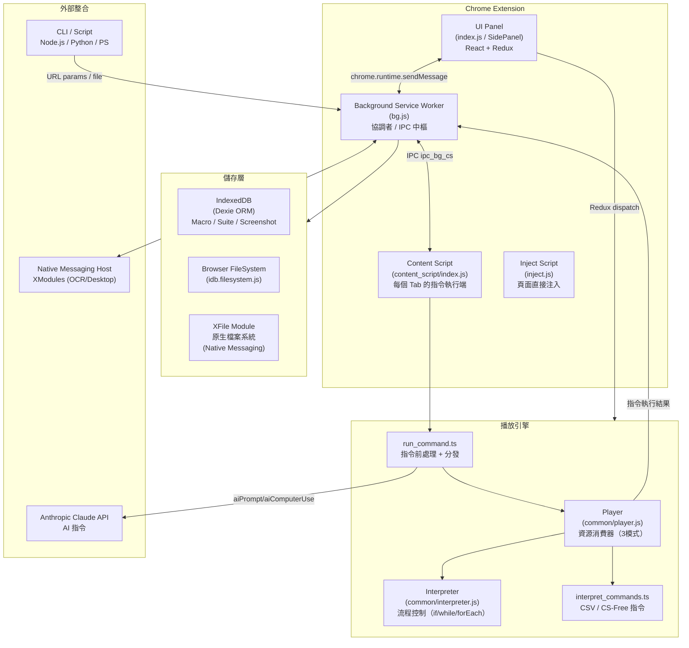

# UI.Vision RPA 技術概覽

## 專案定位

UI.Vision RPA（前身 Kantu）是一套開源的瀏覽器 RPA（Robotic Process Automation）工具，以 Chrome/Firefox/Edge Extension（MV3）為核心，支援 Selenium IDE 相容指令、視覺自動化（Image/OCR/AI）、桌面自動化（透過 XModules 原生橋接），以及透過 CSV 驅動的資料迴圈執行。

授權：AGPLv3（核心）+ 商業授權（進階功能）
版本：9.6.0（manifest.json）

---

## 技術棧

| 層次 | 技術 |
|------|------|
| 擴充套件框架 | Chrome Extension Manifest V3 |
| UI 框架 | React 18 + Redux 5 + Ant Design 5 |
| 語言 | TypeScript 5 + JavaScript（ES2020） |
| 打包 | Webpack 5 + Babel |
| 儲存 | Dexie（IndexedDB ORM）+ chrome.storage.local + XFile（原生檔案系統） |
| 影像辨識 | Tesseract.js（OCR）+ Canvas API（視覺比對）|
| AI 整合 | Anthropic Claude API（aiPrompt/aiScreenXY/aiComputerUse）|
| CSV 處理 | csv npm 套件 |
| 桌面互動 | XModules Native Host（Native Messaging）|
| 腳本執行 | kd-js-interpreter（沙箱 JS 執行）|

---

## 目錄結構說明

```
uivision/
├── src/                   # 主要原始碼
│   ├── ext/               # Extension 入口層
│   │   ├── bg.js          # Background Service Worker（核心協調者）
│   │   ├── inject.js      # 注入頁面的輔助腳本
│   │   ├── content_script/# 每個頁面載入的 CS（命令執行前端）
│   │   ├── popup/         # 舊版 Popup UI 輔助邏輯
│   │   └── common/        # bg/cs 共用的狀態與 tab 管理
│   ├── common/            # 跨所有入口的純工具模組
│   │   ├── command.ts     # 指令清單與工具函式
│   │   ├── variables.js   # 變數系統（${}語法）
│   │   ├── interpreter.js # 流程控制解析器（if/while/forEach）
│   │   ├── player.js      # 播放器核心（Player class）
│   │   ├── ipc/           # Background ↔ Content Script 通訊
│   │   ├── dom_utils.ts   # DOM 操作工具（XPath/CSS selector）
│   │   ├── convert_utils.js # Macro 格式轉換（HTML/JSON）
│   │   └── capture_screenshot.ts # 截圖服務
│   ├── modules/           # 核心執行模組
│   │   ├── run_command.ts # 指令前處理與分發（最大單一檔案，130KB）
│   │   ├── players.tsx    # Macro/Suite 播放器協調
│   │   ├── interpret_commands.ts # CSV 指令與 CS-free 指令
│   │   ├── ocr.ts         # OCR 功能封裝
│   │   └── helper.ts      # 截圖/視窗工具
│   ├── services/          # 服務層（依領域切割）
│   │   ├── storage/       # 儲存管理（Browser / XFile 策略）
│   │   ├── player/        # 播放器狀態（call_stack、monitor）
│   │   ├── xmodules/      # XModules 橋接（xfile、xlocal、xdesktop）
│   │   ├── ai/            # AI 服務（Anthropic、Computer Use）
│   │   ├── ocr/           # OCR 服務（語言、高亮）
│   │   ├── proxy/         # Proxy 設定
│   │   └── vision/        # 視覺搜尋服務
│   ├── models/            # 資料模型（Dexie ORM 封裝）
│   │   ├── db.js          # Dexie 資料庫定義
│   │   ├── test_case_model.js  # Macro CRUD
│   │   └── test_suite_model.js # Suite CRUD
│   ├── actions/           # Redux Action（行為觸發）
│   ├── reducers/          # Redux Reducer（狀態變更）
│   ├── components/        # React UI 元件
│   ├── containers/        # Redux connect 容器
│   ├── recomputed/        # Reselect 派生狀態
│   ├── index.js           # 主 UI 入口（Popup / SidePanel）
│   ├── init_player.js     # 播放器初始化與事件綁定
│   └── search_vision.ts   # 視覺搜尋實作
├── extension/             # 靜態擴充套件資源
│   ├── manifest.json      # MV3 宣告
│   ├── preinstall/        # 預裝 Demo Macro（JSON）和 CSV
│   └── lib/               # 第三方靜態函式庫
├── command-line/          # 外部觸發範例腳本
│   ├── node.js/uitest.js  # Node.js 觸發器（spawn Chrome）
│   ├── python/            # Python 觸發器
│   ├── powershell/        # PowerShell 觸發器
│   └── vbs/               # VBScript 觸發器
├── xrun-scripts/          # XRun 被呼叫腳本範例（.ps1 等）
└── webpack.prod.config.js # 8 個 Entry 的 Webpack 配置
```

---

## 核心架構圖



---

## 指令系統

### 指令結構

每個指令由三個欄位組成：

```typescript
interface Command {
  cmd:    string   // 指令名稱（例如 "click"、"type"）
  target: string   // 目標（XPath / CSS / 圖片檔名 / Label 名稱）
  value:  string   // 值（輸入文字 / 變數名稱 / 條件式）
  description?: string       // 可選描述
  targetOptions?: string[]   // 備選 Locator（UI 錄製時自動產生）
}
```

### 指令分類（來源：`src/common/command.ts`）

| 分類 | 範例指令 | Scope |
|------|----------|-------|
| 導航 | open, openBrowser, refresh | WebOnly |
| 點擊 | click, clickAt, clickAndWait | WebOnly |
| 輸入 | type, sendKeys, editContent | WebOnly |
| 斷言 | assertText, assertTitle, assertElementPresent | WebOnly |
| 驗證 | verifyText, verifyElementPresent | WebOnly |
| 等待 | waitForElementVisible, waitForPageToLoad, pause | WebOnly/All |
| 儲存變數 | store, storeText, storeTitle, storeAttribute | WebOnly/All |
| 流程控制 | if/elseif/else/end, while/end, do/repeatIf, times, forEach, break, continue | All |
| 跳轉 | label, gotoLabel, gotoIf | All |
| CSV | csvRead, csvSave, csvReadArray, csvSaveArray | All |
| 視覺（圖像） | visualSearch, visualVerify, visualAssert, visualGetPixelColor | All |
| 視覺（OCR） | OCRSearch, OCRExtractRelative, OCRExtractScreenshot | All |
| 視覺搜尋區域 | visionLimitSearchArea, visionLimitSearchAreaRelative | All |
| 桌面互動 | XClick, XType, XMove, XRun, XMouseWheel, XDesktopAutomation | All |
| AI | aiPrompt, aiScreenXY, aiComputerUse | All |
| 截圖 | captureScreenshot, captureDesktopScreenshot, captureEntirePageScreenshot | WebOnly/Desktop |
| 腳本執行 | executeScript, executeScript_Sandbox | All |
| 子 Macro | run | All |
| 其他 | echo, comment, throwError, onError, setProxy, setWindowSize | All |

**總計約 100+ 指令**，分 WebOnly / DesktopOnly / All 三個 Scope。

### 指令解析流程

1. `run_command.ts::askBackgroundToRunCommand` 做前處理
   - 變數替換：呼叫 `vars.render()` 把 `${VAR}` 展開
   - 逾時資訊注入到 `command.extra`
   - 特殊簡寫轉換（例如 `#efp` → `#elementfrompoint`）
2. 流程控制指令由 `Interpreter.run()` 攔截（傳回 `isFlowLogic: true`）
3. CSV 指令由 `interpret_commands.ts::interpretCSVCommands` 處理
4. 其餘指令透過 IPC 送到 Content Script 的 `command_runner.js` 執行

---

## Macro 格式規格

### JSON 格式（主要格式）

```json
{
  "Name": "MyMacro",
  "CreationDate": "2024-01-01",
  "Commands": [
    {
      "Command": "open",
      "Target": "https://example.com",
      "Value": "",
      "Description": "開啟網頁"
    },
    {
      "Command": "click",
      "Target": "id=submitBtn",
      "Value": "",
      "Targets": [
        ["id=submitBtn", "id"],
        ["css=button[type='submit']", "css:finder"],
        ["xpath=//button[@type='submit']", "xpath:idRelative"]
      ],
      "Description": ""
    }
  ]
}
```

**欄位說明：**
- `Command`：指令名稱（大小寫不敏感，讀取時會 normalize）
- `Target`：選擇器（格式：`type=value`，例如 `id=foo`、`xpath=//div`、`css=.bar`、圖片：`image.png@0.8#1`）
- `Value`：輸入值或條件
- `Targets`：備選 Locator 陣列（UI 自動錄製時填入，依優先順序排列）
- `Description`：說明（不影響執行）

### HTML 格式（Selenium IDE 相容）

與 Selenium IDE HTML 格式相同：`<table>` 內每行 `<tr>` 對應一個指令，三欄分別是 cmd / target / value。

### Test Suite 格式

```json
{
  "name": "MySuite",
  "macros": [
    { "name": "Macro1", "loop": 1 },
    { "name": "Macro2", "loop": 3 }
  ]
}
```

### 圖像 Target 格式

```
image.png@0.8#2
```
- `image.png`：影像檔名
- `@0.8`：相似度門檻（0.0~1.0，可省略）
- `#2`：匹配序號（第 2 個，從 1 起算，可省略）

---

## 執行引擎運作原理

### Player（`src/common/player.js`）

Player 是通用的「資源消費器」，接受任何資源陣列（Macro 指令列表）並依序執行：

**三種模式：**
- `STRAIGHT`：從 startIndex 執行到 endIndex（預設）
- `SINGLE`：只執行單一指令（步驟調試）
- `LOOP`：在 loopsStart ~ loopsEnd 之間重複執行

**核心方法：**
```
play(config) → prepare() → __go() → run() → handleResult() → __setNext() → __go()
```

**事件系統（EventEmitter）：**
- `START`、`PREPARED`、`TO_PLAY`、`PLAYED_LIST`、`LOOP_START`、`LOOP_RESTART`
- `PAUSED`、`RESUMED`、`END`、`ERROR`、`BREAKPOINT`、`DELAY`

**Token 機制：** 每次 play 生成隨機 token，用來防止 async 回呼在 stop 後繼續執行。

### Interpreter（`src/common/interpreter.js`）

負責流程控制的「前處理」與「後處理」：

**前處理 `preprocess(commands)`：**
- 掃描所有指令，建立 `tags`（if/while/do/times/forEach 的配對索引）
- 建立 `labels` 索引表（供 gotoLabel 使用）
- 驗證巢狀結構完整性（不配對則拋出錯誤）

**執行 `run(command, index)`：**
- 流程控制指令（if/while/end/else 等）在此被攔截，傳回 `isFlowLogic: true` 和 `nextIndex`
- 非流程指令傳回 `isFlowLogic: false`，交給外部實際執行

**後處理 `postRun(command, index, result)`：**
- 根據條件評估結果（`result.condition`），計算下一個執行索引

### 執行流程圖

```
User Click "Play"
    │
    ▼
init_player.js::bindPlayer()
    │ 設定 Player 的 run / prepare / handleResult 函式
    ▼
Player.play(config)
    │
    ▼
Player.__go()
    │
    ├─ Interpreter.run(command)  → isFlowLogic?
    │       ├─ Yes: 取得 nextIndex，跳轉
    │       └─ No: 繼續往下
    │
    ├─ askBackgroundToRunCommand()  → 變數替換 + 逾時注入
    │       │
    │       └─ runCommandInPlayTab()  → IPC → Content Script
    │               │
    │               └─ command_runner.js::run()  → 實際 DOM 操作
    │
    ├─ handleResult()  → Interpreter.postRun()  → 決定 nextIndex
    │
    └─ Player.__setNext()  → Player.__go()  (遞迴)
```

---

## 變數系統

### 語法（`src/common/variables.js`）

```
${VARNAME}          # 用戶定義變數
${!INTERNALVAR}     # 系統內部變數（! 前綴）
${VAR.property}     # 物件屬性存取
${VAR[0]}           # 陣列索引存取
storedVars['VAR']   # 舊版相容語法（withHashNotation）
```

### 系統變數清單（`!` 前綴，大小寫不敏感）

| 變數 | 說明 | 唯讀 |
|------|------|------|
| `!LOOP` | 當前迴圈次數 | 是 |
| `!MACRONAME` | 當前執行的 Macro 名稱 | 是 |
| `!URL` | 當前頁面 URL | 是 |
| `!RUNTIME` | 執行時間（秒） | 是 |
| `!LASTCOMMANDOK` | 上一個指令是否成功 | 是 |
| `!CLIPBOARD` | 剪貼簿內容 | 否 |
| `!STATUSOK` | 整體狀態 | 否 |
| `!ERRORIGNORE` | 忽略錯誤 | 否 |
| `!TIMEOUT_PAGELOAD` | 頁面載入逾時（ms） | 否 |
| `!TIMEOUT_WAIT` | 元素等待逾時（ms） | 否 |
| `!TIMEOUT_MACRO` | Macro 逾時（ms） | 否 |
| `!REPLAYSPEED` | 播放速度（SLOW/MEDIUM/FAST/NODISPLAY） | 否 |
| `!COL1`~`!COLn` | CSV 欄位值 | 否（由 csvRead 填入）|
| `!CSVREADLINENUMBER` | CSV 讀取行號 | 否 |
| `!CSVREADSTATUS` | CSV 讀取狀態（OK/END_OF_FILE） | 是 |
| `!IMAGEX`, `!IMAGEY` | 視覺搜尋結果座標 | 是 |
| `!OCRLANGUAGE` | OCR 語言 | 否 |
| `!OCRENGINE` | OCR 引擎編號 | 否 |
| `!XRUN_EXITCODE` | XRun 子程序退出碼 | 是 |
| `!BROWSER` | 瀏覽器類型 | 是 |
| `!OS` | 作業系統 | 是 |
| `!TIMES` | times 迴圈計數 | 是 |
| `!FOREACH` | forEach 當前元素 | 是 |
| `!AI1`~`!AI4` | AI 指令參數 | 否 |
| `!CMD_VAR1`~`!CMD_VAR3` | 命令列參數 | 是 |

### 變數 API

```javascript
vars.set({ 'MYVAR': 'value' })   // 設定（大小寫不敏感，內部轉大寫）
vars.get('MYVAR')                 // 讀取
vars.render('${MYVAR} text')      // 展開字串中的變數
vars.clear(/^!COL\d+$/i)         // 清除符合 pattern 的變數
vars.dump()                       // 取得全部變數快照
vars.onChange(fn)                 // 監聽變數變化
```

---

## 選擇器系統

### Web 選擇器（`src/common/dom_utils.ts`、`src/ext/content_script/command_runner.js`）

格式：`type=value`

| 類型 | 前綴 | 範例 |
|------|------|------|
| ID | `id=` | `id=submitBtn` |
| Name | `name=` | `name=username` |
| XPath | `xpath=` | `xpath=//button[@type='submit']` |
| CSS | `css=` | `css=.my-class > button` |
| Link Text | `link=` | `link=Click here` |
| DOM | `dom=` | `dom=document.getElementById('x')` |
| Element from Point | `#elementfrompoint (x, y)` | 座標定位 |

UI 錄製時，`targetOptions` 陣列保存多個備選 Locator，執行時依序嘗試直到成功。

### 圖像選擇器（Visual / XClick）

- 由 `parseImageTarget()` 解析：`image.png@confidence#index`
- 透過 Canvas API 做截圖比對（`searchVision` in `search_vision.ts`）
- 結果存入 `!IMAGEX`, `!IMAGEY`, `!IMAGEWIDTH`, `!IMAGEHEIGHT`

### OCR 選擇器（OCRSearch / XClickText）

- 整合 Tesseract.js（引擎 1）或原生 XModule OCR（引擎 2~8）
- 支援區域限制：`visionLimitSearchArea`
- 結果：`!OCRX`, `!OCRY`

### 桌面選擇器（XModules）

- 透過 Native Messaging 呼叫 XDesktop / XLocal XModule
- 支援 Image / OCR 比對，在整個桌面畫面中搜尋

---

## Browser Extension 整合

### Manifest V3 宣告的權限

```
tabs, activeTab, scripting, storage, cookies, debugger,
downloads, downloads.ui, clipboardRead, clipboardWrite,
notifications, bookmarks, proxy, nativeMessaging,
contextMenus, webRequest, webRequestAuthProvider, sidePanel
host_permissions: <all_urls>
```

### 5 個主要 Entry Point（webpack）

| Entry | 說明 |
|-------|------|
| `popup` / `sidepanel` | 主 UI（React App） |
| `bg` | Background Service Worker |
| `content_script` | 注入每個頁面的 CS |
| `inject` | 透過 `scripting.executeScript` 注入的輔助腳本 |
| `csv_editor` / `vision_editor` / `desktop_screenshot_editor` / `options` | 獨立頁面 |

### IPC 架構（`src/common/ipc/`）

```
Panel (UI) ──chrome.runtime.sendMessage──▶ Background (bg.js)
                                              │
                                chrome.tabs.sendMessage
                                              │
                                              ▼
                                     Content Script (cs)
                                              │
                             window.postMessage (跨 iframe)
                                              │
                                              ▼
                                       Inner Frame CS
```

- `ipc_promise.js`：基於 Promise 的雙向 IPC 封裝（uid 對應請求/回應）
- `ipc_bg_cs.js`：Background ↔ CS 的 IPC 工廠，支援 SidePanel 特殊 tabId（999999999）
- `ipc_cs.js`：CS 端的 IPC 客戶端
- `cs_postmessage.js`：CS 之間（跨 iframe）的 postMessage 橋接

### Chrome Storage

使用 `chrome.storage.local` 儲存設定（非 Macro 資料）。
Macro/Screenshot/CSV 資料儲存於 IndexedDB（Dexie）或 XFile 原生檔案系統。

---

## 資料流程圖

### 錄製流程

```
使用者在網頁上點擊/輸入
        │
        ▼
Content Script 偵測 DOM 事件
        │ chrome.runtime.sendMessage
        ▼
Background (bg.js) 接收錄製事件
        │ Redux dispatch
        ▼
Redux Store 更新指令列表
        │
        ▼
React UI 重新渲染顯示
        │
        ▼
使用者點擊「儲存」
        │
        ▼
Dexie IndexedDB 儲存 Macro JSON
（或 XFile 寫入原生檔案系統）
```

### 執行流程

```
使用者點擊「執行」按鈕
        │ Redux dispatch
        ▼
init_player.js 初始化 Player + Interpreter
        │
        ▼
Player.play() → 從 startIndex 開始
        │
        ▼ (每個指令)
run_command.ts::askBackgroundToRunCommand()
    ├── vars.render() 展開 ${VAR}
    ├── 注入 !TIMEOUT / !LOOP 等系統變數
    └── 透過 csIpc.ask() 送到 Content Script
                │
                ▼
    command_runner.js::run()
        ├── 解析 Target（xpath/css/id）
        ├── 執行 DOM 操作（click/type/etc）
        └── 傳回結果
                │
                ▼
Player.handleResult() 更新狀態
Interpreter.postRun() 計算 nextIndex
Player.__setNext() → 繼續下一個
```

### 儲存策略切換（StorageManager）

```
StorageManager
    ├── Browser Mode：IndexedDB（Dexie） + idb.filesystem
    └── XFile Mode：Native Messaging → 原生檔案系統
         └── XFile.sanityCheck() 確認 XModule 可用性
```

---

## 與 Robot 專案可對照的設計模式

### 相似點

| 面向 | UI.Vision（上游） | Robot 專案（下游 Fork） |
|------|-------------------|------------------------|
| 指令清單 | `src/common/command.ts`，~100 個指令 | `src/common/command.ts`，相同清單，僅增加 `setTargetWindow` |
| 執行引擎 | `common/player.js` + `common/interpreter.js` | 完全相同檔案 |
| 變數系統 | `common/variables.js`，`${VAR}` 語法 | 完全相同，含所有系統變數 |
| Redux 架構 | actions → reducers → store | 相同結構 |
| IPC 機制 | `ipc_bg_cs.js` + `ipc_cs.js` | 相同 |
| 儲存層 | `services/storage/` StorageManager | 相同 |
| 選擇器系統 | XPath / CSS / Image / OCR | 相同 |
| Macro 格式 | JSON `{Name, Commands:[{Command,Target,Value}]}` | 相同 |

### 關鍵差異點

| 面向 | UI.Vision（上游） | Robot 專案（下游 Fork） |
|------|-------------------|------------------------|
| AI 整合 | 有 `aiPrompt` / `aiScreenXY` / `aiComputerUse` 指令（呼叫 Anthropic API） | 無 AI 指令（`run_command.ts` 不含 Anthropic import） |
| 服務目錄 | `services/ai/anthropic/` + `services/ai/computer_use/` | 無這兩個目錄 |
| Window 管理 | 無 window_context 服務 | 新增 `services/window/window_context` + `setTargetWindow` 指令（桌面視窗選擇） |
| 版本控制策略 | 上游持續演進（v9.6.0） | Fork 後獨立維護，偶爾同步上游 |
| 程式碼結構 | `src/` 和 `extension/` 分離 | 完全相同分離結構 |

**最關鍵差異的技術含意：**

1. **AI 指令缺失**：Robot 專案的 `run_command.ts` 不 import `AnthropicService`，`aiPrompt`/`aiComputerUse` 不在指令分發流程中。這意味著 Robot 專案如需加入 AI 功能，須從上游移植 `services/ai/` 目錄並在 `run_command.ts` 加入對應 case。

2. **`setTargetWindow` 是 Robot 特有擴充**：這個 DesktopOnly 指令在上游 UI.Vision 不存在，是 Robot 專案針對桌面多視窗場景的自有功能，對應 `services/window/window_context` 服務。

---

## 關鍵檔案索引

| 功能 | 路徑 |
|------|------|
| 指令清單與工具函式 | `src/common/command.ts` |
| 變數系統 | `src/common/variables.js` |
| 流程控制解析器 | `src/common/interpreter.js` |
| 播放器核心 | `src/common/player.js` |
| 指令前處理與分發 | `src/modules/run_command.ts` |
| Macro/Suite 播放協調 | `src/modules/players.tsx` |
| CSV 指令處理 | `src/modules/interpret_commands.ts` |
| Background Service Worker | `src/ext/bg.js` |
| Content Script 入口 | `src/ext/content_script/index.js` |
| Content Script 指令執行 | `src/ext/content_script/command_runner.js` |
| IPC 核心 | `src/common/ipc/ipc_bg_cs.js` |
| IPC Promise 封裝 | `src/common/ipc/ipc_promise.js` |
| Macro 格式轉換 | `src/common/convert_utils.js` |
| DOM 工具 | `src/common/dom_utils.ts` |
| 視覺搜尋 | `src/search_vision.ts` |
| 儲存管理器 | `src/services/storage/index.ts` |
| XFile 橋接 | `src/services/xmodules/xfile.ts` |
| Macro 資料模型 | `src/models/test_case_model.js` |
| 資料庫定義 | `src/models/db.js` |
| Extension Manifest | `extension/manifest.json` |
| Webpack 配置 | `webpack.prod.config.js` |
| CLI 觸發範例（Node.js） | `command-line/node.js/uitest.js` |
| XRun 腳本範例 | `xrun-scripts/PowerShell/test1.ps1` |
| AI 服務（Anthropic） | `src/services/ai/anthropic/anthropic.service.ts` |
| OCR 服務 | `src/modules/ocr.ts` + `src/services/ocr/` |
